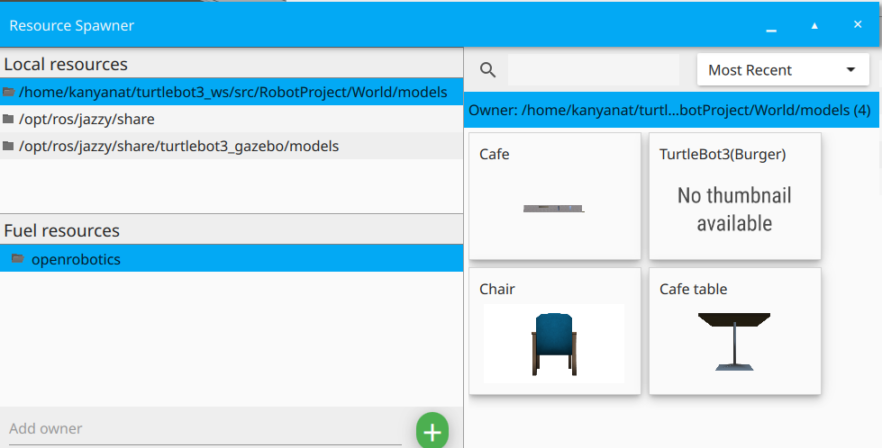

# RobotProject
> cd <your_workspace>/src  
> git clone https://github.com/Kanyanat-Uetrakulchai/RobotProject.git  
> export GZ_SIM_RESOURCE_PATH=`<PATH TO PROJECT>/RobotProject/World/models:$GZ_SIM_RESOURCE_PATH`  
> cd ..  
> rm -rf build install log  
> colcon build  
> source install/setup.bash  
> export TURTLEBOT3_MODEL=burger  
> ros2 launch turtlebot3_gazebo empty_world.launch.py world:=`<PATH TO PROJECT>/RobotProject/World/restaurant.sdf`

ถ้า Local Resources ใน Gazebo Sim ไม่ขึ้นแบบในภาพ

- ลอง `echo $GZ_SIM_RESOURCE_PATH` ถ้ามี `<PATH TO PROJECT>/RobotProject/World/models:$GZ_SIM_RESOURCE_PATH` ขึ้นแล้วแสดงว่าเพิ่มสำเร็จ
- รีสตาร์ทเครื่อง แล้วเปิดโปรแกรมใหม่ ถ้ายังไม่ขึ้นอีกให้รอไปสักพักแล้วค่อยรีสตาร์ทอีกรอบ โปรแกรมมันเปลี่ยนค่อนข้างช้า
